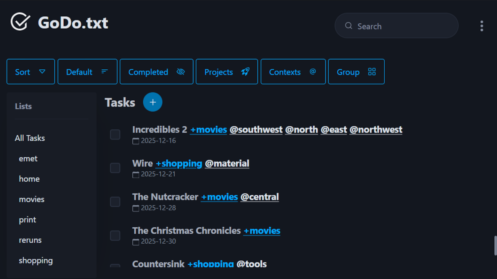

# GoDo.txt

> v4.2.0



## Description

A privacy-friendly cross-platform app to manage a [todo.txt](http://todotxt.org/) file. No databases, no backend server and no communication to any external services or APIs. Todo.txt gives you the flexibility to take your task list with you wherever you go and does not lock you into a proprietary service. All task data is stored in a text file that you can write to using any other application or text editor. GoDo your tasks and worry less about how to maintain it!

## Features

- Non-proprietary management and storage of your tasks utilizing todo.txt's text file format on your own device
- Add, edit and delete tasks
- Manage, filter, sort and group tasks based on `+projects`, `@contexts`, `(A) priorities` or `date created`
- Quickly mark tasks as completed
- Quickly delete all completed tasks
- Side menu with all `+projects` present in your task list for quick filtering
- Privacy-friendly, does not use a server backend or communicates with external APIs or services, everything stays on your own device

**Planned Features**

- Custom attributes such as `due:date`

## Installation

Download and install for your respective OS from the [releasees](https://github.com/aleyoscar/godotxt/releases) page.

**Available platforms:**

- Windows `exe` `msi`
- Android `apk`
- Linux `deb` `rpm` `AppImage`

## Sources

References and sources used in the project.

- [Todo.txt](http://todotxt.org/)
- [Pico CSS](https://picocss.com/)
- [Bootstrap Icons](https://icons.getbootstrap.com/)

> Build

```
python gen-chglog.py {version} -r README.md -r package.json -r src-tauri/tauri.conf.json -r src-tauri/Cargo.toml
# Unstage commit
npm install --package-lock-only
cd src-tauri
cargo update
cd ..
npm run tauri build
npm run tauri android build
```
