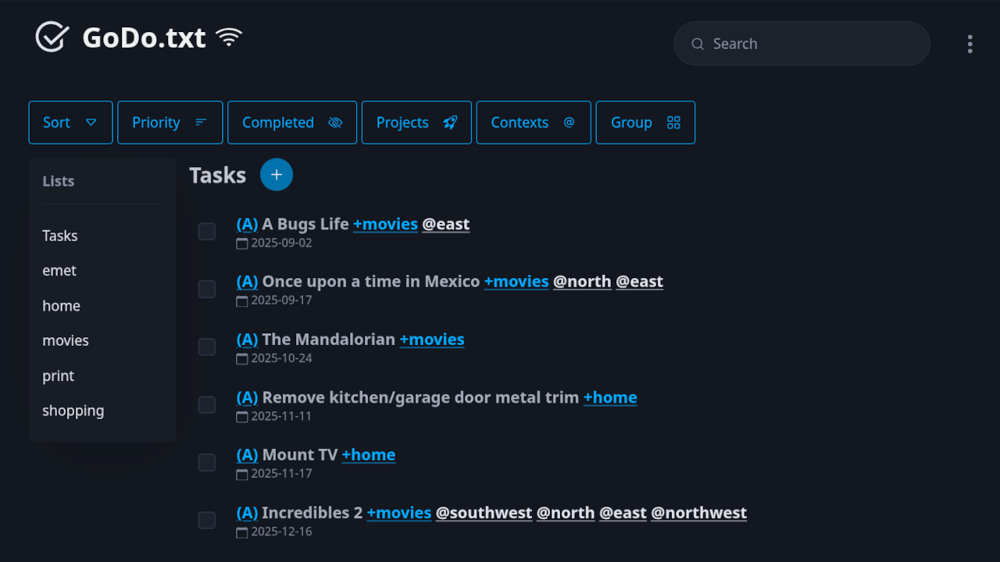

# GoDo.txt

> v2.1.1

Self-hosted web app for todo.txt



## Description

A self-hosted, responsive and mobile-friendly PWA (Progressive Web App) to manage a [todo.txt](http://todotxt.org/) file. Todo.txt gives you the flexibility to take your task list with you wherever you go and does not lock you into a proprietary service. All task data is stored in a text file that you can write to using any other application or text editor. GoDo your tasks and worry less about how to maintain it!

## Features

- Non-proprietary storage system of your tasks utilizing todo.txt's text file format
- Add tasks with `+projects` and `@contexts`
- Edit and delete tasks
- Quickly Delete all completed tasks
- Quickly mark tasks as completed
- Filter, sort and group tasks
- Side menu with all `+projects` present for quick filtering
- Manage your already established todo.txt file by using docker's volumes
- Responsive and mobile-friendly
- Basic authentication using a token (optional)

**Planned Features**

- Custom attributes such as `due:date`

## Installation

1. Clone this repository into a folder or download from [releases](https://github.com/aleyoscar/groctxt/releases)
2. Create a `data` folder and create/copy your `todo.txt` file into it.
3. (Optional) For authentication create a `.env` file with a `TOKEN` key
	- EX: Using Linux/Mac, in a terminal type: `openssl rand -base64 32`
	- Copy the output to a `.env` file like so: `TOKEN={your-token}`
4. Docker run or docker compose:
	- Docker run:
 		- Build image `docker build -t godotxt .`
		- Run `docker run --rm -p 8080:3000 -v ./data:/app/data godotxt`
		- If using an authentication token `docker run --rm -p 8080:3000 -v ./data:/app/data --env-file .env godotxt`
	- Docker compose:
		- Copy the `compose-example.yml` to `compose.yml` and change port if desired
		- First time run `docker compose up --build`
		- Normal start `docker compose up -d`
5. Access the app at [localhost:8080](http://localhost:8080)

## Updating

1. Stop the container `docker compose down`
2. Use `git fetch` and `git pull` to get the latest changes from github.
3. Restart the container `docker compose up --build -d`

## Sources

References and sources used in the project.

- [Todo.txt](http://todotxt.org/)
- [Pico CSS](https://picocss.com/)
- [Bootstrap Icons](https://icons.getbootstrap.com/)


> Changelog script

```
python gen-chglog.py {version} -r static/index.html -r static/sw.js -r README.md -r package.json -r static/site.webmanifest
```
